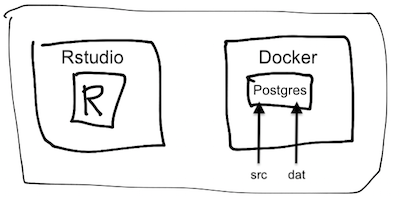
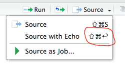

SQL Pet Tutorial
=======

# Next Meeting 9/8 @10am
Location: SW 2730 SW Moody Ave, Portland, OR 97201 

## Agenda:
* Clean-up code/files/help
* Understand code and direction

# Goals

The use case for this repo is:

* You are running R through Rstudio and want to experiment with some of the intricacies of working with an SQL database that has:
    + a moderately complex and unfamiliar structure. 
    + requires passwords and other features found in an organizational environment
    + mostly read but sometimes write to the database

    Here is how R and Docker fit on your operating system in this tutorial:
    
    

    This tutorial uses [the Postgres version of "dvd rental" database](http://www.postgresqltutorial.com/postgresql-sample-database/), which can be  [downloaded here](http://www.postgresqltutorial.com/wp-content/uploads/2017/10/dvdrental.zip).  Here's a glimpse of it's structure:
    
    

* You want to run PostgresSQL on a Docker container, avoiding any OS or system dependencies that might come up. 

Noam Ross's "[Docker for the UseR](https://nyhackr.blob.core.windows.net/presentations/Docker-for-the-UseR_Noam-Ross.pdf)" suggests that there are four distinct use-cases for useRs.  This repo explores #2.

1. Make a fixed working environment
2. Access a service outside of R **(e.g., Postgres)**
3. Create an R based service
4. Send our compute job somewhere else

# Instructions

## Install Docker

Install Docker.  Note that this can be tricky.  

  + [On a Mac](https://docs.docker.com/docker-for-mac/install/)
  + [On Windows](https://docs.docker.com/docker-for-windows/install/) (There are variants and issues that depend on your particular version of the OS, so look carefully at this guide to [Docker Hosting for Windows](docker_hosting_for_windows.md).)
  + [On UNIX flavors](https://docs.docker.com/install/#supported-platforms)

## Download the repo

First step: download [this repo](https://github.com/smithjd/sql-pet).  It contains source code to build a Docker container that has the dvdrental database in Postgress and shows how to interact with the database from R.

# Docker & Postgres

There's a lot to learn about Docker and many uses for it, here we just cut to the chase. 

* Use [./src/1_test_postgres-b.R](./src/1_test_postgres-b.R) to demonstrate that you have a persistent database by uploading `mtcars` to Postgres, then stopping the Docker container, restarting it, and finally determining that `mtcars` is still there. (Note that if you are running Postgres locally, you'll have to close it down to avoid a port conflict.) See the results here: [./src/1_test_postgres-b.md](./src/1_test_postgres-b.md)

**Note:** when running the scripts in this repo, there's a difference between "sourcing" a file and "source with echo".  Use "source with echo":

 

## DVD Rental database installation

* Download the backup file for the dvdrental test database and convert it to a .tar file with:

   [./src/2_get_dvdrental-zipfile.Rmd](./src/2_get_dvdrental-zipfile.Rmd). See the results here: [./src/2_get_dvdrental-zipfile.md](./src/2_get_dvdrental-zipfile.md)

* Create the dvdrental database in Postgres and restore the data in the .tar file with:

   [./src/3_install_dvdrental-in-postgres-b.Rmd](./src/3_install_dvdrental-in-postgres-b.Rmd).  See the results here: [./src/3_install_dvdrental-in-postgres-b.md](./src/3_install_dvdrental-in-postgres-b.md)

## Verify that the dvdrental database is running and browse some tables

* Explore the dvdrental database:

   [./src/4_test_dvdrental-database-b.Rmd](./src/4_test_dvdrental-database-b.Rmd) See the results here: [./src/4_test_dvdrental-database-b.md](./src/4_test_dvdrental-database-b.md)

Need to incorporate more of the [ideas that Aaron Makubuya demonstrated](https://github.com/Cascadia-R/Using_R_With_Databases/blob/master/Intro_To_R_With_Databases.Rmd) at the Cascadia R Conf.

## Interacting with Postgres from R

* keeping passwords secure
* differences between production and data warehouse environments
* overview investigation: do you understand your data
  + documentation and its limits
  + find out how the data is used by those who enter it and others who've used it before
  + what's *missing* from the database: (columns, records, cells)
  + why is there missing data?
* dplyr queries
* examining dplyr queries (show_query on the R side v EXPLAIN on the Postges side)
* performance considerations: get it to work, then optimize
* Tradeoffs between leaving the data in Postgres vs what's kept in R: 
  + browsing the data
  + larger samples and complete tables
  + using what you know to write efficient queries that do most of the work on the server
* learning to keep your DBAs happy

* more topics from [Aaron Makubuya's workshop](https://github.com/Cascadia-R/Using_R_With_Databases/blob/master/Intro_To_R_With_Databases.Rmd) at the Cascadia R Conf.

  + SELECT * vs SELECT list of columns
  + controlling the number of rows returned with WHERE 
  + Glue for constructing SQL statements vs dplyr
  + JOIN flavors
  + parameterizing SQL queries
  + show_query and EXPLAIN
  
# More about Docker & Postgres

## Docker (and R)
* Noam Ross' [talk on Docker for the UseR](https://www.youtube.com/watch?v=803oZI5dvAU&t=1) and his [Slides](https://github.com/noamross/nyhackr-docker-talk) give a lot of context and tips.
* Good Docker tutorials
  + [An introductory Docker tutorial](https://docker-curriculum.com/)
  + [A Docker curriculum](https://katacoda.com/courses/docker)
* Scott Came's materials about Docker and R [on his website](http://www.cascadia-analytics.com/2018/07/21/docker-r-p1.html) and at the 2018 UseR Conference focus on **R inside Docker**.
* It's worth studying the [ROpensci Docker tutorial](https://ropenscilabs.github.io/r-docker-tutorial/)
* Chosing [between Docker and Vagrant](https://medium.com/@Mahmoud_Zalt/vagrant-vs-docker-679c9ce4231b)

## Postgres

* Loading the [dvdrental database into Postgres](http://www.postgresqltutorial.com/load-postgresql-sample-database/)
* To explore the Postgres environment it's worth browsing around inside the Docker command with a shell.

  + To run the Docker container that contains Postgres, you can enter this from a command prompt:

    `$ docker exec -ti sql-pet_postgres9_1 sh`

  + To exit Docker enter:

    `# exit`

  + Inside Docker, you can enter the Postgres command-line utility psql by entering 

    `# psql -U postgres`

    Handy [psql commands](https://gpdb.docs.pivotal.io/gs/43/pdf/PSQLQuickRef.pdf) include:

    + `postgres=# \h`          # psql help
    + `postgres=# \dt`         # list Postgres tables
    + `postgres=# \c dbname`   # connect to databse dbname
    + `postgres=# \l`          # list Postgres databases
    + `postgres=# \conninfo`   # display information about current connection
    + `postgres=# \q`          # exit psql

## Documentation Docker and Postgres

* [The Postgres image documentation](https://docs.docker.com/samples/library/postgres/)
* [Dockerize PostgreSQL](https://docs.docker.com/engine/examples/postgresql_service/)
* Postgres & Docker [documentation](https://docs.docker.com/samples/library/postgres/#postgres_db)
* Usage examples of [Postgres with Docker](https://amattn.com/p/tutorial_postgresql_usage_examples_with_docker.html)

# More Resources
* David Severski describes some [key elements of connecting to databases with R](https://github.com/davidski/database_connections) for MacOS users
* This tutorial picks up ideas and tips from Ed Borasky's [Data Science pet containers](https://github.com/hackoregon/data-science-pet-containers), which creates a framework based on that Hack Oregon example and explains why this repo is named pet-sql.
