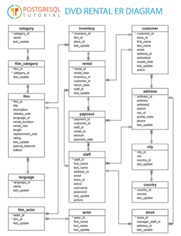

SQL Pet Tutorial
=======

# Goals

The use case for this repo is:

* You are running R through Rstudio and want to experiment with some of the intricacies of working with an SQL database that has:
    + a moderately complex and unfamiliar structure. 
    + requires passwords and other features found in an organizational environment
    + mostly read but sometimes write to the database

    Here is how R and Docker fit on your operating system in this tutorial:
    
    

    This tutorial uses [the Postgres version of "dvd rental" database](http://www.postgresqltutorial.com/postgresql-sample-database/), which can be  [downloaded here](http://www.postgresqltutorial.com/wp-content/uploads/2017/10/dvdrental.zip).  Here's a glimpse of it's structure:
    
    

* You want to run PostgresSQL on a Docker container, avoiding any OS or system dependencies that might come up. 

Trying to build on [ideas that Aaron Makubuya demonstrated](https://github.com/Cascadia-R/Using_R_With_Databases/blob/master/Intro_To_R_With_Databases.Rmd) at the Cascadia R Conf.  Noam Ross's "[Docker for the UseR](https://nyhackr.blob.core.windows.net/presentations/Docker-for-the-UseR_Noam-Ross.pdf)" suggests that there are four distinct use-cases for useRs.  This repo explores #2.

1. Make a fixed working environment
2. Access a service outside of R **(e.g., Postgres)**
3. Create an R based service
4. Send our compute job somewhere else

# Instructions

## Download the repo

First step: download [this repo](https://github.com/smithjd/sql-pet).  It contains source code to build a Docker container that has the dvdrental database in Postgress and shows how to interact with the database from R.

## Docker & Postgres

There's a lot to learn about Docker and many uses for it, here we just cut to the chase. 

* Install Docker.  

  + [On a Mac](https://docs.docker.com/docker-for-mac/install/)
  + [On Windows](https://docs.docker.com/docker-for-windows/install/)
  + [On UNIX flavors](https://docs.docker.com/install/#supported-platforms)

The following .yml file contains the instructions for creating a Docker container that runs Postgres:

* [docker-compose.yml](docker-compose.yml) (Note that if you are running Postgres locally, you'll have to close it down to avoid a port conflict.)

* Use [./src/test_postgres.Rmd](./src/test_postgres.Rmd) to demonstrate that you have a persistent database by uploading `mtcars` to Postgres, then stopping the Docker container, restarting it, and finally determining that `mtcars` is still there.

## DVD Rental database installation

* Download the backup file for the dvdrental test database and convert it to a .tar file with:

   [./src/get_dvdrental-zipfile.Rmd](./src/get_dvdrental-zipfile.Rmd)

* Create the dvdrental database in Postgres and restore the data in the .tar file with:

   [./src/install_dvdrental-in-postgres.Rmd](./src/install_dvdrental-in-postgres.Rmd)

## Verify that the dvdrental database is running and browse some tables

* Notice the process of bringing the Postgres container up in Docker, connecting to Docker from R and then closing it all down at the end:

   [./src/test_postgres.Rmd](./src/test_postgres.Rmd)

* Explore the dvdrental database:

   [./src/test_dvdrental-database.Rmd](./src/test_dvdrental-database.Rmd)

Need to incorporate more of the [ideas that Aaron Makubuya demonstrated](https://github.com/Cascadia-R/Using_R_With_Databases/blob/master/Intro_To_R_With_Databases.Rmd) at the Cascadia R Conf.

## Interacting with Postgres from R

* passwords
* overview investigation
* memory considerations?  creating temporary Postgres tables?
* dplyr queries
* what goes on the database side vs what goes on the R side
* examining dplyr queries (explain on the R side v on the Postges side)
* rewriting SQL
* differences between production and data warehouse environments
* performance considerations: get it to work, then optimize
* learning to keep your DBAs happy

# More about Docker & Postgres

* When you have time explore the Postgres environment it's worth browsing around inside the Docker command with a shell. (Later you might come back to study this [ROpensci Docker tutorial](https://ropenscilabs.github.io/r-docker-tutorial/))

  + To run the Docker container that contains Postgres, you can enter this from a command prompt:

    `$ docker exec -ti sql-pet_postgres9_1 sh`

  + To exit Docker enter:

    `# exit`

  + Inside Docker, you can enter the Postgres command-line utility psql by entering 

    `# psql -U postgres`

    Handy commands inside psql include:

    + `postgres=# \h`          # psql help
    + `postgres=# \dt`         # list Postgres tables
    + `postgres=# \c dbname`   # connect to databse dbname
    + `postgres=# \l`          # list Postgres databases
    + `postgres=# \conninfo`   # list Postgres databases
    + `postgres=# \q`          # exit psql

# More Resources
* Noam Ross' [talk on Docker for the UseR](https://www.youtube.com/watch?v=803oZI5dvAU&t=1) and his [Slides](https://github.com/noamross/nyhackr-docker-talk) give a lot of context and tips.
* A very good [introductory Docker tutorial](https://docker-curriculum.com/)
* Scott Came's materials about Docker and R [on his website](http://www.cascadia-analytics.com/2018/07/21/docker-r-p1.html) and at the 2018 UseR Conference focus on **R inside Docker**.
* Usage examples of [Postgres with Docker](https://amattn.com/p/tutorial_postgresql_usage_examples_with_docker.html)
* David Severski describes some [key elements of connecting to databases with R](https://github.com/davidski/database_connections) for MacOS users
* Loading the [dvdrental database into Postgres](http://www.postgresqltutorial.com/load-postgresql-sample-database/)
* This tutorial picks up ideas and tips from Ed Borasky's [Data Science pet containers]( https://github.com/hackoregon/data-science-pet-containers), which creates a framework based on that Hack Oregon example.

