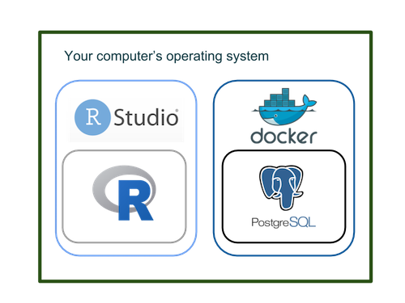

# Introduction

> This chapter introduces:
> 
> * The motivation for this book and the strategies we have adopted
> * How Docker can be used to set up a dbms to demonstrate access to a service like Postgres from R
> * The requirements for setting up the book's sandbox environment 
> * The team that developed the Docker sandbox and wrote the book

## Using R to query a DBMS in your organization

* *Data characteristics*
  * Large data stores in organizations that are kept in SQL databases have specific access constraints and structural characteristics that can be challenging to an R user (*useR* in the jargon).  

* *Technology hurdles*
  * Handling large volumes of data and considering performance issues in a dbms environment require an understanding of what's happening in "the back end" (which is often out of view).
  * The interfaces (passwords, packages, etc.) and gaps between R and a back end database are hidden from public view as a matter of security.
  * Resources for diagnosing interface problem behind corporate walls may or may not address all the issues that R users face, so a **simulated** environment such as we offer here is can be an important learning resources.

* *Use cases*
  * R users frequently need to make sense of complex data structures and coding schemes to address incompletely formed questions: therefore informal exploratory data analysis has to be intuitive and fast. The technology details should not get in the way.
  * Sharing and discussing exploratory and diagnostic techniques of exploration and retrieval is best in public but is constrained by organizational requirements.
  * Data documentation is often incomplete and emphasizes operational characteristics rather than analytic ones.  A careful useR often needs to confirm the documentation on the fly and de-normalize data carefully.

We have found that postgreSQL in a Docker container solves many of the foregoing problems.

## Docker as a tool for UseRs

Noam Ross's "[Docker for the UseR](https://nyhackr.blob.core.windows.net/presentations/Docker-for-the-UseR_Noam-Ross.pdf)" [@Ross2018a] suggests that there are four distinct Docker use-cases for useRs.  

1. Make a fixed working environment for reproducible analysis
2. Access a service outside of R **(e.g., Postgres)**
3. Create an R based service (e.g., with `plumber`)
4. Send our compute jobs to the cloud with minimal reconfiguration or revision

This book explores #2 because it allows us to work on the database access issues described above and to practice on an industrial-scale DBMS.  

* Docker is a comparatively easy way to simulate the relationship between an R/RStudio session and a database -- all on on your machine (provided you have Docker installed and running). 
* Running PostgreSQL on a Docker container avoids OS or system dependencies or conflicts that cause confusion and limit reproducibility. 
* A Docker environment consumes relatively few resources.  Our sandbox does much less but only includes postgreSQL and sample data, so it takes up about 5% of the space taken up by the Vagrant environment that inspired this project. [@Makubuya2018]
* A simple Docker container such as the one used in our sandbox is easy to use and could be extended for other uses.
* Docker is a widely used technology for deploying applications in the cloud, so for many useRs it's worth mastering.

## Docker and R on your machine

Here is an overview of how R and Docker fit on your operating system in this book's sandbox:
    

You run R from RStudio to set up Docker, run postgreSQL inside it and then send queries directly to postgreSQL from R. (We provide more details about our sandbox environment in the chapter on [mapping your environment](#sandbox-environment).

## Who are we?

We have been collaborating on this book since the Summer of 2018, each of us chipping into the project as time permits:

* Dipti Muni - [\@deemuni](https://github.com/deemuni)
* Ian Franz - [\@ianfrantz](https://github.com/ianfrantz)
* Jim Tyhurst - [\@jimtyhurst](https://github.com/jimtyhurst)
* John David Smith - [\@smithjd](https://github.com/smithjd)
* M. Edward (Ed) Borasky - [\@znmeb](https://github.com/znmeb)
* Maryanne Thygesen [\@maryannet](https://github.com/maryannet)
* Scott Came - [\@scottcame](https://github.com/scottcame)
* Sophie Yang - [\@SophieMYang](https://github.com/SophieMYang)

## How did this project come about?

We trace this book back to the [June 2, 2018 Cascadia R Conf](https://cascadiarconf.com/) where Aaron Makubuya gave [a presentation using Vagrant hosting](https://github.com/Cascadia-R/Using_R_With_Databases) [@Makubuya2018].  After that [John Smith](https://github.com/smithjd), [Ian Franz](https://github.com/ianfrantz), and [Sophie Yang](https://github.com/SophieMYang) had discussions after the monthly [Data Discussion Meetups](https://www.meetup.com/Portland-Data-Science-Group/events/fxvhbnywmbgb/) about the difficulties around setting up Vagrant, (a virtual environment), connecting to a corporate database and having realistic **public** environment to demo or practice the issues that come up behind corporate firewalls. [Scott Came's](https://github.com/scottcame) tutorial on [R and Docker](http://www.cascadia-analytics.com/2018/07/21/docker-r-p1.html) [@Came2018] (an alternative to Vagrant) at the 2018 UseR Conference in Melbourne was provocative and it turned out he lived nearby.  We re-connected with [M. Edward (Ed) Borasky](https://github.com/znmeb) who had done extensive development for a [Hack Oregon data science containerization project](https://github.com/hackoregon/data-science-pet-containers) [@Borasky2018].

